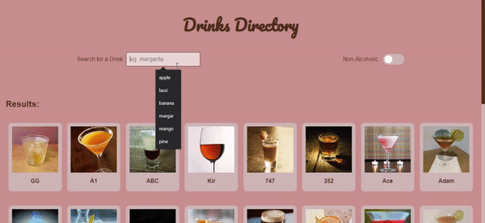

# Drinks Directory SITE: [Visit Here](https://drinksdirectory.netlify.app/)

  

A simple directory site that allows you to search among thousands of drinks for recipe and ingredients. The site allows you to filter between alcoholic and non-alcoholic drinks. It is available online for visit [here](https://drinksdirectory.netlify.app/)

### Purpose:

The purpose was to build a simple project using cocktaildb API and polish my skills while working with APIs. 

### Lessons Learned:

Its good to keep the footer sticking to the bottom of the page. It will prevent the footer from coming up incase you don't have much content on the page. Also you can simply filter the received data yourself if the API does not provide that filter.

### Languages and Tools:

### More Projects with API usage:

<table bordercolor="#66b2b2">
  
  <tr>

<td width="50%"  style="align:center;" valign="top">
<a target="_blank" href="https://github.com/Alamicrodev/Nasa_PictureOfTheDay-Site">Nasa POTD</a>
         
      
    </td>

<td width="50%"  style="align:center;" valign="top">
<a target="_blank" href="https://github.com/Alamicrodev/Random_DogPicture_Generator-Site">Random Dog Picture Generator</a>
         
      
    </td> 

  </tr>
</table> 